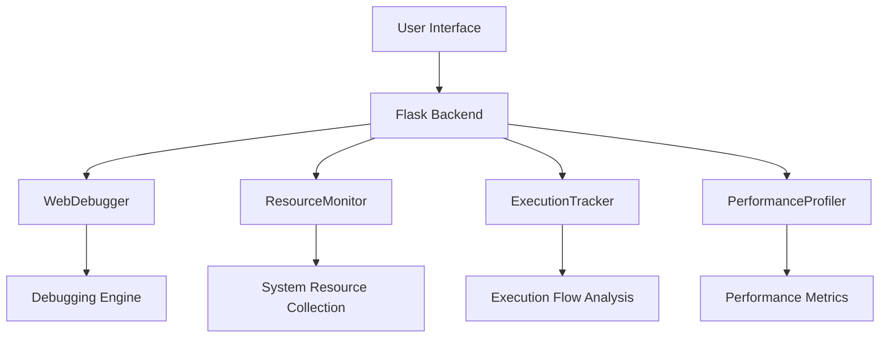

# ReLive Debugger

## Project Description

ReLive Debugger is an advanced Python debugging platform designed to provide developers with comprehensive code execution analysis, performance profiling, and system resource monitoring. The project aims to transform traditional debugging workflows by offering an integrated, interactive development environment with real-time insights.

## Table of Contents

1. [System Architecture](#system-architecture)
2. [Installation](#installation)
3. [Core Components](#core-components)
4. [Advanced Features](#advanced-features)
5. [Debugging Workflow](#debugging-workflow)
6. [Performance Analysis](#performance-analysis)
7. [System Requirements](#system-requirements)
8. [Configuration](#configuration)
9. [Contributing](#contributing)
10. [License](#license)

## System Architecture

### High-Level Design

ReLive Debugger employs a modular architecture with multiple interconnected components:

| Component | Responsibility | Key Technologies |
|-----------|----------------|-----------------|
| Web Interface | User Interaction | HTML5, JavaScript, Chart.js |
| Backend Server | Debugging Logic | Flask, Python Debugger (bdb) |
| Resource Monitor | System Performance Tracking | psutil |
| Execution Tracker | Code Flow Analysis | Custom Python Tracing |
| Performance Profiler | Function Performance Measurement | Python Profiling Tools |

### Architectural Diagram




## Installation

### Comprehensive Setup Guide

#### Dependency Requirements

Ensure the following dependencies are installed:

```python
dependencies = [
    'flask',          # Web framework
    'psutil',         # System resource monitoring
    'pygments',       # Code highlighting
    'chart.js',       # Performance visualization
    'mermaid-js'      # Flowchart generation
]
```

#### Virtual Environment Setup

```bash
# Create virtual environment
python3 -m venv debugger_env

# Activate environment
source debugger_env/bin/activate  # Unix/macOS
debugger_env\Scripts\activate     # Windows

# Install dependencies
pip install -r requirements.txt
```
#### Run the code
```bash
python3 run.py
```

## Demo Images

| Feature | Visualization |
|---------|---------------|
| Debugger with loading file, step into, step over, step back, call stack, variables (global and local) and execution features |  |
| Performance Profile with function execution time and function call distribution |  |
| Execution flows with call graphs showing graphical visualization for the function calls |  |
| Execution flows showing the function called flowchart within the script |  |
| Feature to debug and evaluate code snippets as an artifact, giving side effects |  |
| Setting Breakpoints, as well as Conditional Breakpoints |  |
| Feature to code in the GUI Debugger itself and debug it |  |
| Detailed System information display for better debugging analysis |  |


## Core Components Deep Dive

### WebDebugger Class

The `WebDebugger` class serves as the central debugging mechanism, extending Python's base debugging framework.

```python
class WebDebugger(bdb.Bdb):
    def __init__(self):
        super().__init__()
        self.breakpoints = {}              # Track breakpoint locations
        self.stack_frames = []             # Maintain execution stack
        self.variables = {}                # Store variable states
        self.execution_tracker = ExecutionTracker()
        self.profiler = PerformanceProfiler()
        
    def user_line(self, frame):
        """Intercept code execution at each line"""
        self.current_frame = frame
        self.stack_frames = self._get_stack_frames()
        self.variables = self._get_variables(frame)
```

### Performance Profiler Architecture

```python
class PerformanceProfiler:
    def __init__(self):
        self.function_times = {}
        self._start_times = {}
    
    def start_function(self, func_name, line_no):
        """Begin performance tracking for a function"""
        timestamp = time.time()
        self._start_times[func_name] = timestamp
        
        if func_name not in self.function_times:
            self.function_times[func_name] = {
                'total_time': 0,
                'calls': 0,
                'avg_time': 0,
                'line': line_no
            }
```

## Advanced Features

### Breakpoint Management

ReLive Debugger supports multiple breakpoint types:

1. Standard Line Breakpoints
2. Conditional Breakpoints
3. Dynamic Breakpoint Modification

```python
def set_conditional_break(self, filename, lineno, condition):
    """Set a breakpoint with a dynamic condition"""
    self.set_break(filename, lineno)
    self.conditional_breakpoints[filename][lineno] = condition
```

### Code Evaluation Mechanism

The integrated code evaluator allows runtime code snippet testing:

```python
def evaluate_code(self, code, line_number=None):
    """Dynamically evaluate code snippets during debugging"""
    try:
        local_context = self.current_frame.f_locals
        global_context = self.current_frame.f_globals
        
        result = eval(code, global_context, local_context)
        return {
            'result': repr(result),
            'side_effects': self.detect_side_effects()
        }
    except Exception as error:
        return {'error': str(error)}
```

## Performance Analysis Techniques

### Execution Time Tracking

```python
def analyze_function_performance(code_segment):
    """Comprehensive performance analysis"""
    start_time = time.perf_counter()
    execution_result = execute(code_segment)
    end_time = time.perf_counter()
    
    return {
        'execution_time': end_time - start_time,
        'memory_usage': measure_memory_consumption(),
        'result': execution_result
    }
```


## Features

### Step-through Debugging

Step-through debugging lets you execute your code one line at a time, making it easier to understand the flow and catch bugs early. The current line of code will be highlighted, and the program will pause on each step.

For example, consider the following Python code:

```python
def main():
    print("Hello, Debugger!")
    x = 5
    y = 20
    result = x + y
    print(f"Result: {result}")
main()
```

### Breakpoints

Breakpoints are set at specific points in the code where the debugger will pause execution. This allows you to inspect the state of variables and the program's flow at critical points.

To set breakpoints, simply specify the line numbers in the Breakpoints input field:

```
5, 10, 15
```


The program will pause at lines 5, 10, and 15, allowing you to inspect variables or perform any other action needed to diagnose issues.

**Example:**

```python
def test_function():
    a = 10
    b = 20
    breakpoint()  # Execution pauses here
    result = a + b
    print(result)

```
### Debug Console

The debug console is where the output of your code will be displayed. It shows print statements, exceptions, and any other runtime information.

For example, the output in the console might look like this:

```
Hello, Debugger! Result: 25
```


This provides an interactive way to follow the output and inspect the behavior of your program.


### Graphical View
The graphical view is a simple, visual representation of the program's execution. It highlights the currently executing line of code and any breakpoints that have been set.

The graphical view makes it easier to understand the flow of the program, especially when dealing with complex logic.

### Code Editor
The code editor displays your code with syntax highlighting. As you step through the program, the current line is highlighted, and the editor scrolls to ensure the active line is visible.

```ruby
1: def main():
2:     print("Hello, Debugger!")
3:     x = 5
4:     y = 20
5:     result = x + y
6:     print(f"Result: {result}")
7: main()
```

The code editor enables you to interact with your code directly in the browser, allowing you to make edits, view variables, and debug errors.

# Usage
### Starting the Debugger
To begin debugging, upload a Python or JavaScript file via the file input. Once the file is uploaded, click the Start Debugger button, and the debugger will initialize.

### Step Execution
To execute the code step by step, click the Step button. The debugger will pause at the current line, allowing you to inspect the program's state and variables.

### Continue Execution
Click Continue to run the code until the next breakpoint or the end of the program.

### Quit Debugger
Click Quit to stop the debugging session and reset the state of the debugger.

### Setting Breakpoints
To set breakpoints, enter the line numbers (comma-separated) into the Breakpoints field, such as:
```
5, 10, 15
```
Click Set Breakpoints, and the debugger will pause execution at those points.

### Debug Console

This shows the output and any other relevant data to be shown in the console of the debugger.

### File Upload
Upload your Python or JavaScript file using the file input field:

```ruby
<input type="file" id="fileInput" accept=".py, .js" />
```
After selecting your file, the debugger will load it and allow you to step through the code.


## System Requirements

### Minimum Configuration

| Component | Requirement |
|-----------|-------------|
| Python Version | 3.8+ |
| RAM | 4 GB |
| Processor | x86-64 architecture |
| Disk Space | 100 MB |

### Recommended Configuration

| Component | Specification |
|-----------|---------------|
| Python Version | 3.9+ |
| RAM | 8 GB |
| Processor | Multi-core x86-64 |
| Disk Space | 250 MB |

## Configuration Options

### Environment Variables

```python
DEBUG_SETTINGS = {
    'MAX_EXECUTION_DEPTH': 100,
    'ENABLE_PERFORMANCE_LOGGING': True,
    'RESOURCE_MONITOR_INTERVAL': 1.0,
    'DETAILED_TRACING': False
}
```

## Contributing Guidelines

### Development Workflow

1. Fork Repository
2. Create Feature Branch
3. Implement Changes
4. Write Comprehensive Tests
5. Update Documentation
6. Submit Pull Request

### Code Quality Standards

- PEP 8 Compliance
- Type Hinting
- Comprehensive Docstrings
- 90%+ Test Coverage

## Future Roadmap

### Planned Enhancements

- Machine Learning Performance Optimization
- Multi-language Debugging Support
- Cloud Debugging Infrastructure
- Enhanced Visualization Techniques
- Real-time Collaborative Debugging

## **License**
This project is licensed under the [MIT License](https://opensource.org/licenses/MIT).

```text
MIT License

Copyright (c) 2025 Anee Jain

Permission is hereby granted, free of charge, to any person obtaining a copy of this software and associated documentation files (the "Software"), to deal in the Software without restriction, including without limitation the rights to use, copy, modify, merge, publish, distribute, sublicense, and/or sell copies of the Software, and to permit persons to whom the Software is furnished to do so, subject to the following conditions:

The above copyright notice and this permission notice shall be included in all copies or substantial portions of the Software.

THE SOFTWARE IS PROVIDED "AS IS", WITHOUT WARRANTY OF ANY KIND, EXPRESS OR IMPLIED, INCLUDING BUT NOT LIMITED TO THE WARRANTIES OF MERCHANTABILITY, FITNESS FOR A PARTICULAR PURPOSE AND NONINFRINGEMENT. IN NO EVENT SHALL THE AUTHORS OR COPYRIGHT HOLDERS BE LIABLE FOR ANY CLAIM, DAMAGES OR OTHER LIABILITY, WHETHER IN AN ACTION OF CONTRACT, TORT OR OTHERWISE, ARISING FROM, OUT OF OR IN CONNECTION WITH THE SOFTWARE OR THE USE OR OTHER DEALINGS IN THE SOFTWARE.
```


## Contact & Connect

<div align="center">
    <a href="mailto:utso_s@ma.iitr.ac.in">
        
    </a>
    <a href="https://github.com/officiallyutso">
        
    </a>
    <a href="https://linkedin.com/in/utsosarkar">
        
    </a>
    <a href="https://utso.netlify.app">
        
    </a>
    <a href="https://instagram.com/the_Arjo">
        
    </a>
</div>

### Let's Connect!

Feel free to reach out for collaborations, questions, or just to say hi! I'm always open to interesting conversations and opportunities.

---

** Quick Contact:**
- **Email:** utsosarkar1@gmail.com
- **Location:** IIT ROORKEE, India
